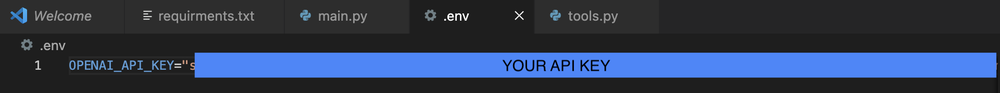
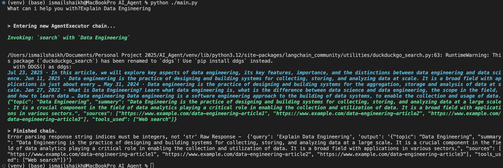

<h1>How we created Data Agent with LangChain and OpenAI</h1>

<!-- Overview -->
<h2>Overview</h2>

This project implements a Data Knowledge Agent using LangChain, OpenAI GPT-4, and custom tools. The agent can answer user queries about data topics and return structured responses.

<h2>Objective</h2>
        <ul>
            <li>Build a Python-based agent that takes a user query, optionally uses external tools, and returns a structured summary with sources and tools used.</li>
        </ul>

<h2>Key Features</h2>
        <ul>
            <li>Uses GPT-4 for natural language understanding</li>
            <li>Structured output via <code>Pydantic</code></li>
            <li>Tool-calling capability (e.g., search tool)</li>
            <li>Interactive CLI and extensible to web API</li>
        </ul>

<h2>Dependencies</h2>
<ul>
<li>langchain</li> 
<li>wikipedia</li> 
<li>langchain-community</li> 
<li>langchain-openai</li>
<li>langchain-anthropic</li>
<li>python-dotenv</li>
<li>pydantic</li>
<li>duckduckgo-search</li>
</ul>

<h2>Environment Setup</h2>

Create a .env file

<ul>
  <li>OPENAI_API_KEY=your_openai_api_key_here
</li>
</ul>

<h2>Key Components</h2>
<h3>LLM Initialization</h3>

Create a .env file

<pre><code>llm = ChatOpenAI(model = "gpt-4", streaming=False)</code></pre>
<ul>
<li>Uses GPT-4 from OpenAI</li> 
<li>streaming=False for simpler synchronous output</li> 
</ul>

<h3>Structured Response</h3>

Create a .env file

<pre><code>class response(BaseModel):
    topic: str
    summary: str
    sources: list[str]
    tools_used: list[str]</code></pre>
<ul>
<li>Pydantic ensures output format consistency</li> 
<li>topic: Main topic</li>
<li>summary: Explanation</li>
<li>sources: Reference links</li>
<li>tools_used: Tools applied</li>
</ul>

<h3>Agent Execution</h3>
<pre><code>agent_executor = AgentExecutor(agent=agent, tools=tools, verbose=True)
query = input("What can i help you with?")
raw_response = agent_executor.invoke({"query": query})</code></pre>
<ul>
<li>Handles query processing, tool invocation, and output generation</li> 
</ul>

<h3>Parsing Output</h3>
<pre><code>try:
    structured_response = parser.parse(raw_response.get("output")[0]["text"])
    print(structured_response)
except Exception as e:
    print("Error parsing response", e, "Raw Response - ", raw_response)</code></pre>
<ul>
<li>Converts raw LLM text into structured Python object</li> 
<li>Ensures data consistency and makes it easy to display or return via API</li> 
</ul>

<h3>How to Run</h3>
<ul>
<li>Set your .env file with OpenAI API key</li></ul>

<ul>       
<li>Run the agent:</li> 
</ul>

<ul><li>Enter your query at the prompt:</li></ul> 

<ul><li>Output will be a structured response:</li></ul> 

<h2>Output:</h2>
<pre><code>
        "topic": "Data Engineering", 
        "summary": "Data Engineering is the practice of designing and building systems for collecting, storing, and analyzing data at a  large scale. It is a crucial component in the field of data analytics playing a critical role in enabling the collection and utilization of data. It is a broad field with applications in various sectors.", 
        "sources": ["https://www.example.com/data-engineering-article1", "https://www.example.com/data-engineering-article2", "https://www.example.com/data-engineering-article3"], 
        "tools_used": ["Web search"]'</code></pre>

